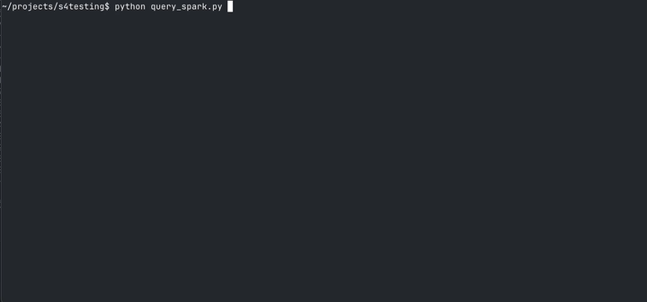
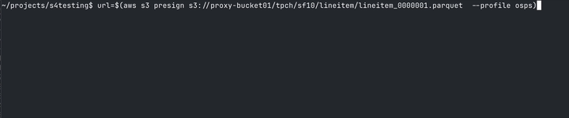

## example 1
Upload to an aws bucket. Profile osps is using &lt;osp⚡&gt; over https, myaws is direct.


## example 2

{ width=120px }

1. Generate some [TCPH](https://www.tpc.org/tpch/) testdata using <i class="fab fa-github"> </i> [dbgen](https://github.com/jeroenflvr/dbgen) with a table on an aws bucket and another table on an ibm cos bucket. 


2. Create two views.  All using just 1 set of credentials.
```python
import os
from pyspark.sql import SparkSession
from pyspark.sql.functions import col, count, max as _max, desc

access_key = os.environ["AWS_ACCESS_KEY_ID"]
secret_key = os.environ["AWS_ACCESS_SECRET_KEY"]

spark = SparkSession.builder \
    .appName("TPCH") \
    .config("spark.hadoop.fs.s3a.access.key", access_key) \
    .config("spark.hadoop.fs.s3a.secret.key", secret_key) \
    .config("spark.hadoop.fs.s3a.endpoint", f"https://localhost:8443") \
    .config("spark.hadoop.fs.s3a.impl", "org.apache.hadoop.fs.s3a.S3AFileSystem") \
    .config("spark.hadoop.fs.s3a.path.style.access", "true") \
    .getOrCreate()

spark.sparkContext.setLogLevel("ERROR")

customers = spark.read.parquet("s3a://proxy-bucket01/tpch/sf10/customer/")
orders    = spark.read.parquet("s3a://proxy-aws-bucket01/tpch/sf10/orders/")

# join, aggregate, sort, and limit
top10_customers = (
    customers
      .join(orders, customers.c_custkey == orders.o_custkey)
      .groupBy(
          customers.c_custkey.alias("custkey"),
          customers.c_name.alias("name")
      )
      .agg(
          count(orders.o_orderkey).alias("order_count"),
          _max(orders.o_orderdate).alias("last_order_date")
      )
      .orderBy(desc("order_count"))
      .limit(10)
)

top10_customers.show(truncate=False)
```



## example 3
Using &lt;osp⚡&gt; as download/upload interface in a fastapi python backend (using [&lt;/&gt; htmx](https://htmx.org/) for our convenience)

When a download link is clicked, present a presigned link in either a dialog or hidden on the page and use javascript to click it so the download starts.

## example 4
Generate a presigned url against the &lt;osp⚡&gt; endpoint and download a file, going through the same &lt;osp⚡&gt; gateway.


