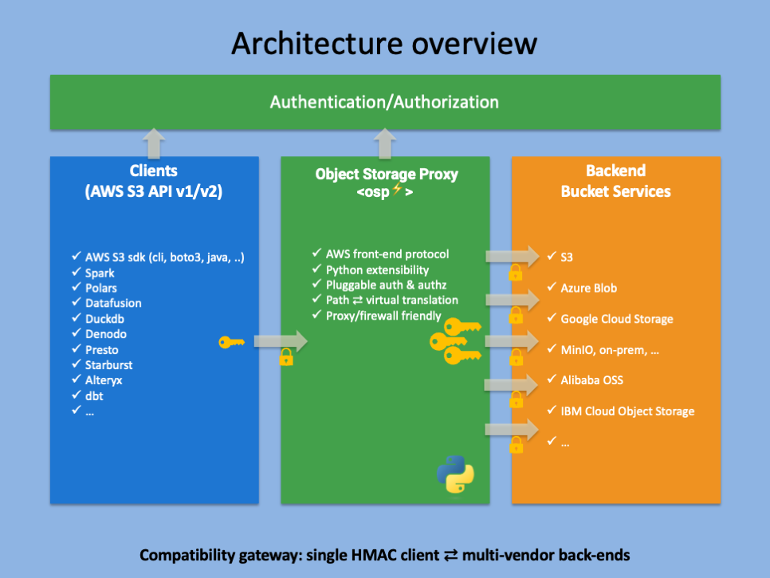

# &lt;osp⚡&gt; Object Storage Proxy

A fast and safe in-process gateway for AWS S3 and compatible services (IBM Cloud Object Storage, Minio, ...).

*⎯ Speed, Security, Simplicity. Pick three. ⎯*

## What &lt;osp⚡&gt; Does & Why It Matters

### 🚀 Instant, Identity-Aware Access to Any Bucket  
Drop this proxy in front of S3, GCS, IBM COS, Azure Blob, MinIO, or Ceph. It accepts whatever your users already have—OIDC, SAML, JWT, mTLS—then transparently signs and routes the request to the right backend. No hard-coded keys, no presigned URLs, no code changes.

### 🔒 Single-Point Policy Enforcement  
Write authorization rules once in **Python** (or call OPA, Redis, SQL—your choice). The proxy evaluates them *in-process* on every `DELETE`/`GET`/`HEAD`/`LIST`/`POST`/`PUT`/`...`, so compliance checks and tenant isolation happen at wire-speed, not in scattered app code.

<span style="color: white; background-color: red; padding: 2px 5px; border-radius: 3px; font-weight: bold;">NEW!</span> Apply fine-grained permissions on any prefix, make exceptions, etc.

### ⚡ Zero Extra Hop, Wire-Speed Throughput  
Because auth and streaming live in the **same memory space**, there’s no second network trip like with sidecars or external gateways. Data flows straight from bucket to client—up to **40 % lower p99 latency** in real-world benchmarks.

### 📊 Observability Where It Counts  
Built-in Prometheus metrics and OpenTelemetry traces wrap the exact bytes crossing the wire. You’ll see authentication failures, object sizes, and transfer times without bolting Lua or WASM onto a generic proxy.

---

### The Problems &lt;osp⚡&gt; Eliminates

| Pain Point | How We Solve It |
|------------|-----------------|
| **Credentials sprawl & secret leaks** | Front-end receives tokens; only the proxy holds bucket keys, so nothing sensitive reaches clients, browsers or notebooks. |
| **Slow, brittle presigned URL workflows** | Users hit one stable URL; the proxy handles signing on the fly. |
| **Duplicate auth logic in every service** | Central policy engine with Python hooks—change rules in one place. |
| **Vendor lock-in & expensive rewrites** | Abstracts away bucket type; switch providers or split traffic without touching client code. |
| **Complex proxies that require custom plugins** | Lightweight binary / `pip` package; you extend it with plain Python, not unfamiliar DSLs. |

> **Bottom line:** &lt;osp⚡&gt; turns object-storage access into a fast, secure, one-line integration—so your team ships features instead of fighting buckets.


## Features

* Scalable fast in-process gateway.
* Compatible with anything that supports the AWS SDK -> aws cli/boto3, Polars, Spark, Datafusion, Presto, dbt, ...
* Decouples frontend from backend authentication and authorization: plug in your authentication and authorization services. 
* Flexible extensible Python configuration and interface: pass in callables for credentials fetching, validation, lookup secret for access_key (with cache).
* Compatibility Gateway between systems that are limited to single hmac credentials pair, and distributed multi-vendor multi-credentials buckets backends.
* Seemlessly translate requests between path and virtual addressing style.
* Compatible with corporate firewalled and proxied networks.
* Low-code integration in typical storage browsers with python backend (see [example #3](index.md/#integrated-in-a-fastapi-app)).
* Support for presigned urls the same way as regular requests.
* Credentials support for classic hmac keypair and IBM api_key authentication.
* <span style="color: white; background-color: red; padding: 2px 5px; border-radius: 3px; font-weight: bold;">NEW!</span> Apply fine-grained permissions on any prefix, make exceptions


## Architecture Overview




## Performance
Performance is pretty good.  Even when using the python callback functions, since they're only called once and then cached for the remainder of the requests or until ttl expiration.

An upload to aws bucket: the osps profile is using &lt;osp⚡&gt; over https, myaws is direct.


## Configuration

### Proxy

```python
    ProxyServerConfig(
        cos_map=cos_map,
        bucket_creds_fetcher=fetch_hmac_creds,
        validator=do_validation,
        http_port=6190,
        https_port=8443,
        threads=1,
        verify=False,
        hmac_keystore=hmac_keys,
        skip_signature_validation=False,
        hmac_fetcher=lookup_secret_key
    )
```

| argument | description | optional | default value |
| -------- | ----------- | -------- | ------------- |
| cos_map | bucket configuration, see below | | NA |
| bucket_creds_fetcher | python callable to retrieve credentials for a given bucket, to return either api key or hmac key pair | ✅ | NA |
| validator | python callable, validates access for a given token/bucket combination | ✅ | NA |
| http_port | server listener port on http | ✅ at least http_port or https_port, or both | NA |
| https_port | server listener port on https | ✅ at least http_port or https_port, or both | NA |
| threads | number of service threads | ✅ | 1 |
| verify | ignore ssl verification errors on backend storage (for dev purposes) | ✅ | False |
| hmac_keystore | | | |
| skip_signature_validation | ignore ssl verification errors on frontend (for dev purposes) | ✅ | False |
| hmac_fetcher | python callable, gets the private/secret key for a given public/access key | ✅ | NA |


### Buckets

- endpoint host
- port
- api key (optional)
- hmac access key (optional)
- hmac secret key (optional)
- ttl (optional, default 300) -> keep this reasonably short, but size to your needs

```json
cos_map = {
    "proxy-bucket01": {  # <- no keys, will be fetched at first call
        "host": "s3.eu-de.cloud-object-storage.appdomain.cloud",
        "port": 443,
        "ttl": 300
    },
    "proxy-aws-bucket01": {
        "host": "s3.eu-west-3.amazonaws.com",
        "region": "eu-west-3",
        "access_key": os.getenv("AWS_ACCESS_KEY"),
        "secret_key": os.getenv("AWS_SECRET_KEY"),
        "port": 443,
        "ttl": 300
    }    
}
```

### Python callback functions

| argument | description | signature | 
| -------- | ----------- | -------- | 
| bucket_creds_fetcher | python callable to retrieve credentials for a given bucket, to return either api key or hmac key pair |  <pre><code class="language-python">def callable(token: str, bucket: str) -> str </code></pre> |
| validator | python callable, validates access for a given token/bucket combination |  <pre><code class="language-python">def callable(token: str, bucket: str) -> bool </code></pre>  |
| hmac_fetcher | python callable, gets the private/secret key for a given public/access key | <pre><code class="language-python">def callable(access_key: str) -> Optional[str ] </code></pre> | NA |


```python
def do_hmac_creds(token: str, bucket: str) -> str:
    """ Fetch HMAC credentials (ro, rw, access_denied) for the given bucket, depending on the token """
    access_key = os.getenv("ACCESS_KEY")
    secret_key = os.getenv("SECRET_KEY")
    if not access_key or not secret_key:
        raise ValueError("ACCESS_KEY or SECRET_KEY environment variable not set")
        
    print(f"Fetching HMAC credentials for {bucket}...")

    return json.dumps({
        "access_key": access_key,
        "secret_key": secret_key
    })

def lookup_secret_key(access_key: str) -> str | None:
    # get all environment variables ending in ACCESS_KEY
    access_keys = [{key:value} for key, value in os.environ.items() if key.endswith("ACCESS_KEY") and value==access_key ]

    if len(access_keys) > 0:
        access_key_var = next((k for k, v in access_keys[0].items() if v == access_key), None)

        secret_key_var = access_key_var.replace("ACCESS_KEY", "SECRET_KEY")
        return os.getenv(secret_key_var, None)
    else:
        print(f"no access keys found for : {access_key}")


def do_validation(token: str, bucket: str) -> bool:
    """ Authorize the request based on token for the given bucket. 
        You can plug in your own authorization service here.
        The token is a client identifier used to fetch an authorization token and further authenticate/authorize.
        The bucket is the bucket name.
        The function should return True if the request is authorized, False otherwise.
    """

    print(f"PYTHON: Validating headers: {token} for {bucket}...")
    # return random.choice([True, False])
    return True
```

## Full example

With local configuration.

~/.aws/config
```ini
[profile osps]
region = eu-west-3
output = json
services = osp-services
s3 =
    addressing_style = path

[services osps-services]
s3 =
  endpoint_url = https://localhost:8443
```

~/.aws/credentials
```ini
[osps]
aws_access_key_id = MYLOCAL123  # <-- this could be an internal client identifier, to fetch openid connect/oauth2 token or anything that makes sense for your business
aws_secret_access_key = my_private_secret # <-- private key to sign original request
```

Set up a minimal server implementation:
```python
import json
import os
import random
import strtobool
import object_storage_proxy as osp

from dotenv import load_dotenv

from object_storage_proxy import start_server, ProxyServerConfig


def do_api_creds(token: str, bucket: str) -> str:
    """Fetch credentials (ro, rw, access_denied) for the given bucket, depending on the token. """
    apikey = os.getenv("COS_API_KEY")
    if not apikey:
        raise ValueError("COS_API_KEY environment variable not set")
    
    print(f"Fetching credentials for {bucket}...")
    return apikey


def do_hmac_creds(token: str, bucket: str) -> str:
    """ Fetch HMAC credentials (ro, rw, access_denied) for the given bucket, depending on the token """
    access_key = os.getenv("ACCESS_KEY")
    secret_key = os.getenv("SECRET_KEY")
    if not access_key or not secret_key:
        raise ValueError("ACCESS_KEY or SECRET_KEY environment variable not set")
        
    print(f"Fetching HMAC credentials for {bucket}...")

    return json.dumps({
        "access_key": access_key,
        "secret_key": secret_key
    })

def lookup_secret_key(access_key: str) -> str | None:
    # get all environment variables ending in ACCESS_KEY
    access_keys = [{key:value} for key, value in os.environ.items() if key.endswith("ACCESS_KEY") and value==access_key ]

    if len(access_keys) > 0:
        access_key_var = next((k for k, v in access_keys[0].items() if v == access_key), None)

        secret_key_var = access_key_var.replace("ACCESS_KEY", "SECRET_KEY")
        return os.getenv(secret_key_var, None)
    else:
        print(f"no access keys found for : {access_key}")


def do_validation(token: str, bucket: str) -> bool:
    """ Authorize the request based on token for the given bucket. 
        You can plug in your own authorization service here.
        The token is a client identifier used to fetch an authorization token and further authenticate/authorize.
        The bucket is the bucket name.
        The function should return True if the request is authorized, False otherwise.
    """

    print(f"PYTHON: Validating headers: {token} for {bucket}...")
    return True


def main() -> None:
    load_dotenv()

    counting = strtobool(os.getenv("OSP_ENABLE_REQUEST_COUNTING", "false"))

    if counting:
        osp.enable_request_counting()
        print("Request counting enabled")

    apikey = os.getenv("COS_API_KEY")
    if not apikey:
        raise ValueError("COS_API_KEY environment variable not set")

    cos_map = {
        "proxy-bucket01": {
            "host": "s3.eu-de.cloud-object-storage.appdomain.cloud",
            "region": "eu-de",
            "port": 443,
            "ttl": 300
        },
        "proxy-aws-bucket01": {
            "host": "s3.eu-west-3.amazonaws.com",
            "region": "eu-west-3",
            "access_key": os.getenv("AWS_ACCESS_KEY"),
            "secret_key": os.getenv("AWS_SECRET_KEY"),
            "port": 443,
            "ttl": 300
        }
    }

    hmac_keys= [
        {
            "access_key": os.getenv("LOCAL2_ACCESS_KEY"),
            "secret_key": os.getenv("LOCAL2_SECRET_KEY")
        },

    ]

    ra = ProxyServerConfig(
        cos_map=cos_map,
        bucket_creds_fetcher=do_hmac_creds,
        validator=do_validation,
        http_port=6190,
        https_port=8443,
        threads=1,
        # verify=False, <-- DEV/TEST only
        hmac_keystore=hmac_keys,
        skip_signature_validation=False,
        hmac_fetcher=lookup_secret_key
    )

    start_server(ra)


if __name__ == "__main__":
    main()

```

Run with [aws-cli](https://docs.aws.amazon.com/cli/latest/userguide/getting-started-install.html) (but could be anything compatible with the aws s3 api like polars, spark, presto, ...):

```bash
$ aws s3 ls s3://proxy-bucket01/ --recursive --summarize --human-readable --profile osp
2025-04-17 17:45:30   33 Bytes README.md
2025-04-17 17:48:04   33 Bytes README2.md

Total Objects: 2
   Total Size: 66 Bytes
$
```

See more examples [here](index.md#more-examples).

## More Examples

### Upload to an aws bucket
Profile osps is using &lt;osp⚡&gt; over https, myaws is direct.


### Generate TPC-H test data using duckdb

{ width=120px }

Generate some [TPC-H](https://www.tpc.org/tpch/) testdata using <i class="fab fa-github"> </i> [dbgen](https://github.com/jeroenflvr/dbgen) with a table on an aws bucket and another table on an ibm cos bucket. 


{ width=120px }

Create two dataframes from the tpc-h dataset generated earlier, for customer and orders.
Get the top 10 customers.
All using a single set of credentials.

```python
import os
from pyspark.sql import SparkSession
from pyspark.sql.functions import col, count, max as _max, desc

access_key = os.environ["AWS_ACCESS_KEY_ID"]
secret_key = os.environ["AWS_ACCESS_SECRET_KEY"]

spark = SparkSession.builder \
    .appName("TPCH") \
    .config("spark.hadoop.fs.s3a.access.key", access_key) \
    .config("spark.hadoop.fs.s3a.secret.key", secret_key) \
    .config("spark.hadoop.fs.s3a.endpoint", f"https://localhost:8443") \
    .config("spark.hadoop.fs.s3a.impl", "org.apache.hadoop.fs.s3a.S3AFileSystem") \
    .config("spark.hadoop.fs.s3a.path.style.access", "true") \
    .getOrCreate()

spark.sparkContext.setLogLevel("ERROR")

customers = spark.read.parquet("s3a://proxy-bucket01/tpch/sf10/customer/")
orders    = spark.read.parquet("s3a://proxy-aws-bucket01/tpch/sf10/orders/")

# join, aggregate, sort, and limit
top10_customers = (
    customers
      .join(orders, customers.c_custkey == orders.o_custkey)
      .groupBy(
          customers.c_custkey.alias("custkey"),
          customers.c_name.alias("name")
      )
      .agg(
          count(orders.o_orderkey).alias("order_count"),
          _max(orders.o_orderdate).alias("last_order_date")
      )
      .orderBy(desc("order_count"))
      .limit(10)
)

top10_customers.show(truncate=False)
```


### 🔜 Integrated in a Fastapi app

Using &lt;osp⚡&gt; for download/upload interface within a fastapi python backend (using [&lt;/&gt; htmx](https://htmx.org/) for our convenience)

Then, ie. when a download link is clicked, generate a presigned link in either a dialog for the user or hidden on the page and use javascript to initiate the download.


### Presigned url
Generate a presigned url against the &lt;osp⚡&gt; endpoint and download a file, going through the same &lt;osp⚡&gt; gateway.


### Query from two different vendors using Presto
{ width=180px } 
{ width=120px }

Create TPC-H customer and order tables using spark, on two different buckets, customer on aws and orders on ibm bucket.

```python
import os
from pyspark.sql import SparkSession

aws_access_key_id = os.environ["AWS_ACCESS_KEY_ID"]
aws_secret_access_key = os.environ["AWS_SECRET_ACCESS_KEY"]
region = "eu-west-3"

spark = (
    SparkSession.builder.appName("S3AExample")
    .config("spark.hadoop.fs.s3a.access.key", aws_access_key_id)
    .config("spark.hadoop.fs.s3a.secret.key", aws_secret_access_key)
    .config("spark.hadoop.fs.s3a.endpoint", f"http://localhost:6190")
    .config("spark.hadoop.fs.s3a.impl", "org.apache.hadoop.fs.s3a.S3AFileSystem")
    .config("spark.hadoop.fs.s3a.path.style.access", "true")
    .config("spark.sql.catalogImplementation", "hive")
    .config("spark.hadoop.hive.metastore.uris", "thrift://localhost:9083")
    .getOrCreate()
)

spark.sql(
    """
        CREATE EXTERNAL TABLE default.customer (
        c_custkey     BIGINT,
        c_name        STRING,
        c_address     STRING,
        c_nationkey   BIGINT,
        c_phone       STRING,
        c_acctbal     DOUBLE,
        c_mktsegment  STRING,
        c_comment     STRING
        )
        STORED AS PARQUET
        LOCATION 's3a://proxy-aws-bucket01/tpch/sf10/customer'
    """
)

spark.sql(
    """
        CREATE EXTERNAL TABLE IF NOT EXISTS default.orders (
        o_orderkey     BIGINT,
        o_custkey      BIGINT,
        o_orderstatus  STRING,
        o_totalprice   DOUBLE,
        o_orderdate    DATE,
        o_orderpriority STRING,
        o_clerk        STRING,
        o_shippriority INT,
        o_comment      STRING
        )
        STORED AS PARQUET
        LOCATION 's3a://proxy-bucket01/tpch/sf10/orders'
    """
)
spark.stop()
```

Tables
```SQL
[root@dbc8ec99fdc5 /]# presto-cli --server localhost:8080 --catalog hive --schema default
presto:default> SHOW CREATE TABLE hive.default.customer;
                             Create Table
-----------------------------------------------------------------------
 CREATE TABLE hive.default.customer (
    "c_custkey" bigint,
    "c_name" varchar,
    "c_address" varchar,
    "c_nationkey" bigint,
    "c_phone" varchar,
    "c_acctbal" double,
    "c_mktsegment" varchar,
    "c_comment" varchar
 )
 WITH (
    external_location = 's3a://proxy-aws-bucket01/tpch/sf10/customer',
    format = 'PARQUET'
 )
(1 row)

Query 20250504_175810_00013_d86su, FINISHED, 1 node
Splits: 1 total, 1 done (100.00%)
[Latency: client-side: 74ms, server-side: 59ms] [0 rows, 0B] [0 rows/s, 0B/s]

presto:default> SHOW CREATE TABLE hive.default.orders;
                          Create Table
-----------------------------------------------------------------
 CREATE TABLE hive.default.orders (
    "o_orderkey" bigint,
    "o_custkey" bigint,
    "o_orderstatus" varchar,
    "o_totalprice" double,
    "o_orderdate" date,
    "o_orderpriority" varchar,
    "o_clerk" varchar,
    "o_shippriority" integer,
    "o_comment" varchar
 )
 WITH (
    external_location = 's3a://proxy-bucket01/tpch/sf10/orders',
    format = 'PARQUET'
 )
(1 row)

Query 20250504_175812_00014_d86su, FINISHED, 1 node
Splits: 1 total, 1 done (100.00%)
[Latency: client-side: 74ms, server-side: 56ms] [0 rows, 0B] [0 rows/s, 0B/s]

presto:default>
```


Query tables using presto-cli


## Contact

[✉️ Email us at info@flexworks.eu](mailto:info@flexworks.eu)